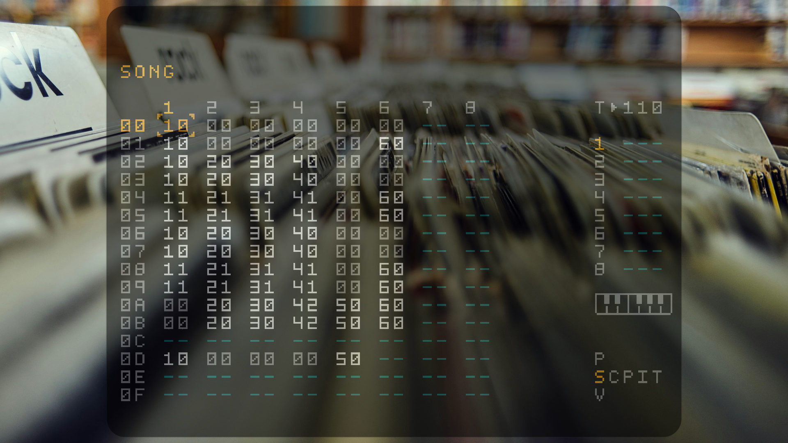

# ArchM8C-HyprJack: A Simple Script for a Dirtywave M8 Console on archlinux with jack and midi.
This repository has a simple script that turns your (old)computer into an "M8C Console" for the Dirtywave M8 or the Dirtywave M8 Headless. 
It uses Jack as audio server and sets up the right audio in- and outputs and MIDI connection. It also uses Hyprland to show a floating tranparent window of M8C in the center of the screen with a nice wallpaper.


## Prerequisites

This script is designed for use on a fresh minimal Arch Linux system with the following requirements:

- An active internet connection
- A user account with sudo privileges
- Git

Install Arch Linux using the `archinstall` script for simplicity.

>1. Select your local mirror location.
>2. Enter disk configuration, use best effort on your desired drive and select ext4 filesystem.
>3. make a user account with sudo privileges.
>4. Enter additional packages to install, and type `git` then press enter
>5. Select your timezone.
>6. Enter configure network, select use networkmanager.
>7. Install.


## Installation Instructions


1. Clone the repository:
   ```bash
   git clone https://github.com/roterodamus/archm8c-hyprjack.git
   ```

2. Navigate to the cloned directory:
   ```bash
   cd archm8c-hyprjack
   ```

3. Make the installation script executable:
   ```bash
   chmod +x init.sh
   ```

4. Run the installation script:
   ```bash
   ./init.sh
   ```
## Post install

### After installation, you'll need to set your sound card and MIDI in the jack-m8c.sh script. 

Find the name of the sound card you want to use, usually something like PCM, USB, or CODEC.  
Make a note of it. 
 ```bash
aplay -l
 ```
 Now do the same for your MIDI controller. Find it and make note of it.
 ```bash
aconnect -l
 ``` 
 Open the jack-m8c.sh script.
 At the top of the script, replace "USB" with the name of your sound card and replace "SINCO" with the name of your MIDI controller. 
 ```bash
nano archm8c-hyperjack/jack-m8c.sh  
 ```
 

Press `Ctrl + O` to save changes.  
Press `Ctrl + X` to exit nano.

### you might want to modify the hyprland config if your monitor resolution is not 1920 x 1080.
at the bottom of the script you can uncomment the option for your matching resolution.
In this script you can also set a different wallpaper, or set up hyprland however you want.

 ```bash
nano .config/hypr/hyprland.conf
 ```
Press `Ctrl + O` to save changes.  
Press `Ctrl + X` to exit nano.

### Finally reboot to apply all settings

## Basic hyprland Keybindings Overview

**SUPER = WindowsKey or similar**

- **Launch Terminal**: `SUPER + Q` 
- **Kill Active Window**: `SUPER + C`
- **Launch File Manager**: `SUPER + E`
- **Open Menu**: `SUPER + SPACE`
- **Switch to Workspace 1 - 10**: `SUPER + 1 - 0`
- **Move to Workspace 1 - 10**: `SUPER + SHIFT + 1 - 0`

## A very special thanks to:

- Trash80 - [Dirtywave](https://dirtywave.com/)
- Laamaa  - [M8C](https://github.com/laamaa/m8c)
- and the entire FOSS Linux community.
